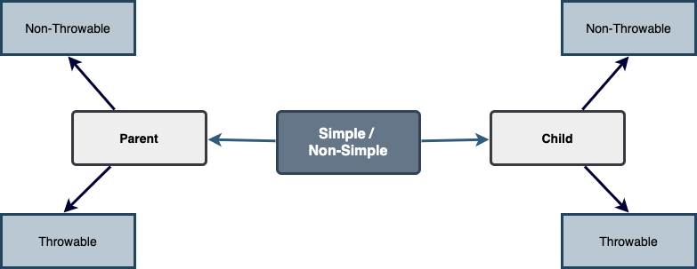

# 🦾 Vader 🦾


---

# Why a new Framework for Bean validation?

When it comes to Bean validation, [Spring Bean Validation](https://reflectoring.io/bean-validation-with-spring-boot/) is the most popular framework. But it comes with a lot of *Spring-baggage* and does a lot of *Annotation-Magic*. Although this is simple, simplicity comes at the cost of losing a lot of flexibility. It works well for simple Data validations like checking Min/Max, but as the validations get complex, the code turns convoluted and it gets difficult to manage all those validations popping up as annotations across your Domain objects.

There is no way to configure the order of validations, which is required when you need a *Fail-Fast* strategy and want to load validations in the ascending order of their cost. Especially, if your service accepts a batch of requests (A Batch service), it gets really difficult to manage partial failures.

### How is Salesforce core dealing with this?

Predominantly with `if-else-try-catch` pyramids, which can spike your Cyclomatic & Cognitive complexities and renders a *difficult-to-test-and-manage* code-base. Also having validations as loose functions can create a mess of function calls like this:


Instead, this framework promises you a hierarchical Orchestration of Validations, which can fit in our head easily while understanding or debugging the code:


### Prove it!

Watch this Tech-talk as a prerequisite to understanding why `if-else-try-catch` is easy to start but difficult to manage and how Vader disciplines your code-base:

Proposal: https://overfullstack.github.io/posts/fight-complexity-with-fp/

Video: [Fight Complexity with Functional Programming, JavaBin, Norway](https://youtu.be/tnpL1O8kTbM)

---

### More videos

These recordings are initial presentations for Vader within the team. Below docs are comprehensive covering everything (and more) in these videos. So you may either start with these or jump directly to the docs:

> ⚠️ Few things changed from these recordings, but Vader philosophy remains the same.

[Brown Bag Session](https://drive.google.com/open?id=1AciJ3xU5HFgeTwJxL0RME0mQVO08BMQ9)

[An Internal Presentation](https://drive.google.com/open?id=1Syi3smlcyFAL0ZoDuq5dWR1IALZNmNUm) (This is partially recorded)

---

# What Requirements does Vader cater?

You may consider using this framework if your bean validation has the following requirements:

- Configure the order of Validations
- Cross-Share Common & Nested Validations among services
- Support Fail-Fast and Error-Accumulation Strategies
- Capture Partial failures (In Batch Services)
- Cater both non-Batch and Batch services

- Meta-Requirements
  - Accommodate a century validations
  - Unit testability
  - No compromise on Performance

---

## 🍢 Vader is just a Bunch of Design-Patterns stitched together 🍡

### Visitor/Strategy + Chain of Responsibility + Builder + Monad


Vader's Implementation is agnostic of the consumer's --

- Request Type  
- Failure Type
- Framework used

---

# How do I consume Vader?

- Write your validations as First-Class Functions.
- Stitch your validations together into a Chain.
- Call the API function as per the execution strategy.

Let's deep dive how Vader can help you in each of these steps:

---

# First-Class Validation?

### The job of validation is simple, just to convey if a POJO is valid or why it is invalid.

### Vader provides various **Validator Types**, to get this done.

---

# Validator Types

These are generic data types to which a lambda can be assigned. They are called *Simple* as they work with Simple types as Input/Output

### SimpleValidator `(ValidatableT) -> FailureT`

The Data type for simple first-class functions. They take in a bean to be validated, represented by `ValidatableT`, and returns a failure `FailureT`.

```java
public static final SimpleValidator<Parent, ValidationFailure> validation1 =
            parentInputRepresentation -> {
                if (parentInputRepresentation._isSetPaymentAuthorizationId()) {
                    return null;
                } else {
                    return new ValidationFailure(ApiErrorCodes.REQUIRED_FIELD_MISSING, FIELD_NULL_OR_EMPTY,
                            ERROR_LABEL_PARAM_PAYMENT_AUTHORIZATION_ID);
                }
            };
```

### SimpleThrowableValidator `(ValidatableT) -> FailureT` (throws UncheckedException)

This is the same as `SimpleValidator` but the body of the function does some side-effects (DB calls/Network calls) which are exception prone, i.e., it may throw an unchecked exception. Using this Data type for any lambda avoids using `try-catch` boilerplate inside the method body and Vader takes care of it. The how part will be covered in the DSL section.

```java
static final SimpleThrowableValidator<Parent, ValidationFailure> validationThrowable1 =
            parentInputRepresentation -> {
                throw new IllegalArgumentException("1 - you did something illegal");
            };
```

---

# But if you need more ⚡️Power⚡️


---

# Validator Types

Unlike Simple validation types (which work with Simple input/output types), these Data types work with `Either` types as input/output. The `Either` type is borrowed from `Vavr` library. More about it can be read [here](https://www.vavr.io/vavr-docs/#_either).

### But what's so powerful about `Either`?

With `Either`, You get all the functional programming powers. You can write linear programs with a lot less **Cyclomatic Complexity** & **Cognitive Complexity**.

Please refer to this tech talk discussing these concepts: [Fight Complexity with Functional Programming, JavaBin, Norway](<https://youtu.be/tnpL1O8kTbM>)

### Validator `Either<FailureT, ValidatableT> -> Either<FailureT, ?>`

Functions assigned to these Data types take `Either<FailureT, ValidatableT>` as input. Since the input is pre-wrapped in an `Either`, you can perform all the `Either` operations on the input like `map`, `flatMap`, `fold`, `filterOrElse` (Refer [API](https://www.javadoc.io/doc/io.vavr/vavr/0.10.2/io/vavr/control/Either.html) for more info). 

The result of the function is supposed to be `Either<FailureT, ?>`. This signifies, if there is a Validation Failure, keep it in the *left* state. If the `Either` in the result is in *right* state, it is considered that the bean **Passed** the validation. The wildcard `?` signifies it doesn't matter what is the value in the right state.

```java
public static final Validator<Parent, ValidationFailure> batchValidation1 =
            parentInputRepresentation -> parentInputRepresentation
                    .filterOrElse(Parent::_isSetAccountId, ignore -> new ValidationFailure(
                            ApiErrorCodes.REQUIRED_FIELD_MISSING,
                            FIELD_NULL_OR_EMPTY,
                            ERROR_LABEL_PARAM_PAYMENT_AUTHORIZATION_ID));
```

### ThrowableValidator

Handling exceptions with `try-catch` hinders the linear program flow, and add extra branch adding-up to the **Cognitive Complexity**. But if the function is assigned to this Data type, you can omit all the exception handling and delegate that to the Vader. We shall see in the DSL section how this can be achieved.

```java
public static final ThrowableValidator<Parent, ValidationFailure> batchValidationThrowable1 =
            parentInputRepresentation -> {
                throw new IllegalArgumentException("1 - you did something illegal");
            };
```

---

# What Data types to Use?

These 4 types that Vader provides, is to help developers focus only on their validation logic, not worry about boiler-plate and use a programming style (imperative or functional) that they are comfortable in. You can essentially use any Data type for your validators and in-fact you can even have a mix, based on your needs. Vader leaves the choice to the developer. If you are using a mix, there's a little *Stitching* job you need to perform, which we shall see in the DSL section.

---

# Types of Validations in a Service



- Non-Simple refers to the `Validator` type 
- Parent refers to a Bean which consists of Nested beans
- Child refers to a nested bean inside a Parent

---

# How to Structure these validations

Vader allows validations to align with the Bean Structure, which is hierarchical. The bean presented for validation (Validatable) can be seen as the root bean, and it can nest children and children can nest children too, to any level of depth. Having validations align to the same structure makes the design declarative and offers the following advantages:

- You instantly know where the problem is if a validation misbehaves.
- It's easy to extend validations of a Validatable at any level, without worrying about its Parent and Children.
- A validatable is agnostic of its container or children. This gives immense flexibility when your Bean restructures or new Children are added at various levels. The Stitching of all these validations can happen in a config, which will be the only place of change in this case. Let's see how it's done.

---

# How to Stitch all these in a config 🏋🏻‍♂️

Using these Data types for lambdas, we essentially use functions as values. So, all we need is an Ordered List (like `java.util.list`) to maintain the sequence of validations. We can compose all the validation functions, in the order of preference. This order is easily **Configurable**.
However, there is a complexity. A List of Validations for a container node consists of a mix of container node and member node validations. But they can't be put under one `List`, as they are functions on different Data Types. So member validations need to be ported to the container context. We can achieve this with **Higher-Order Functions**, which act as DSL (Domain Specific Language) to **lift** member validation to the container type.
This is a powerful technique, which enables us to see the code through the lens of **Algebra**. This way, we can configure a **Chain** of validations in-order, sorting out all the container-member dependencies. This is nothing but the most popular **Chain of Responsibility** Design pattern, with a functional touch.
If the inter-dependencies between Parent-Child happens to be more complex, we may end-up with *Graph* relationship, but we can easily *flatten* it into a Chain with simple *Topological Sort*.
Similarly, Vader has DSL to port Simple Validator types to Non-Simple ones. This is handy, when you have a mix of validations, and they all need to be of the same type to stitch them together.
Below are the DSLs currently available, with self-explanatory names. There are multiple overloads suitable for simple/non-simple. The Java Docs should guide you to use proper overload:

## DSL for Child to Parent

|                            |                               |
| -------------------------- | ----------------------------- |
| liftToParentValidationType | liftAllToParentValidationType |
|                            |                               |

## DSL for Simple, Non-Simple, Throwable

| **Simple**    | **Simple Throwable**   | **Throwable**    |
| ------------- | ---------------------- | ---------------- |
| liftSimple    | liftSimpleThrowable    | liftThrowable    |
| liftAllSimple | liftAllSimpleThrowable | liftAllThrowable |


## Deferred result

If you skim through the source code, you can realize none of these DSL functions does any execution. They simple take-in a function and return another function, deferring the actual execution until you call any API method in the *RunnerDSL* below:

---

# Run Strategies

Now that we saw how to write validations and how to stitch them together in any order, the last step left is to utilize an out-of-the-box runner to run all these validations against one or batch of validatables. This can be seen as the **Edge** for validation bounded context, where the actual execution of validations happen and you get back the final result in the form of `ValidationFailure` (For Non-Batch) or a list of `Either<ValidationFailure, Validatable>` (For Batch partial failures).
Vader has a **RunnerDSL**, which has API methods for the below strategies. There are various flavors (Overloads) of these strategies for Batch/Non-Batch and Simple/Non-Simple (Please refer to Java Docs).

### `validateAndFailFast`

### `validateAndAccumulateErrors`

---

# Future Roadmap

- Parallel runner to run validations in parallel
- Timeouts for validations
- Context aware validations to share data among validations

---


---

# Source-code Setup

- This is a simple Gradle project, and has its own Gradle wrapper. So nothing to install. As of writing this, Gradle v7.0 is used.
- For source code navigation you need to have **[Lombok](https://projectlombok.org/)** plugin, which is used to generate boilerplate code. 
  There are plugins available for Lombok for all popular IDEs, which you need to install. The latest version of the plugin should work.

---

# Jar release process

## CI/CD

- The CI/CD pipeline is all setup for this library. So, as soon as you push a commit (on any branch), a CI job starts and pushes the new jar into nexus. 
- The job status can be monitored [here](https://ccspaymentsci.dop.sfdc.net/).

## Manual

- If you want to manually publish jar to nexus from you local, you need to have the necessary permissions to release jar into Nexus for both SNAPSHOTS and RELEASE channels. This Gus item was raised for Nexus access - https://gus.my.salesforce.com/a07B0000007Qt0BIAS. Please reach out to this team for any Nexus related permissions, problems, or requirements.
- As of today, the permissions are maintained by providing a role `CCSPayments`. We are planning to create a AD group for this.
- Increment the version property `version = "<Version-Number>"` and run this command.

  ```shell
  ./gradlew publish
  ```
- After publishing, you can verify it by searching in the [Nexus Repo](https://nexus.soma.salesforce.com/nexus/index.html#welcome).
