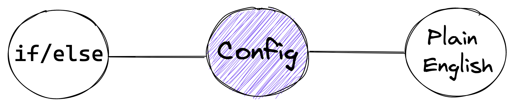

= Config Driven Validation
Gopal S Akshintala <gopala.akshintala@salesforce.com>
:Revision: 1.0
ifdef::env-github[]
:tip-caption: :bulb:
:note-caption: :information_source:
:important-caption: :heavy_exclamation_mark:
:caution-caption: :fire:
:warning-caption: :warning:
endif::[]
:hide-uri-scheme:

== Translate your Spike doc to Type-safe code (line-to-line)!

The idea is, just take your validation requirements from the spike doc and describe them in a Type-safe format through a `Config`.
Vador does the rest!

== Configure your validation requirements

Think of it as the entity XML we write, where we don't write the actual DDL, but a definition of it in XML, and platform takes care of the rest.
We do something similar here, just that we use Java instead of XML for more data-type safety.

== Config Types we use for this flow

=== link:../../../docs/config-dsl/ContainerValidationConfig.adoc[ContainerValidationConfig] 

=== link:../../../docs/config-dsl/ContainerValidationConfigWith2Levels.adoc[ContainerValidationConfigWith2Levels]

=== link:../../../docs/config-dsl/BatchValidationConfig.adoc[BatchValidationConfig]
